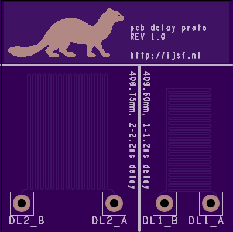

# PCB delay line prototype board

This PCB has been designed as an experimental prototype board containing copper PCB traces in microstrip formation with a controlled tranmission propagation delay (Tpd).

This board has been designed using Cadence ORCad Capture and Cadence Allegro PCB Editor 16.6.

## Version history

### Revision 1.0

This revision contains two copper traces with an estimated Tpd of 1ns (`DL1`) and 2ns (`DL2`).

## Remarks

### OSHPark export from Allegro

Some useful information regarding exporting the Gerber and NC drill files from Allegro:

* [http://oshpark.com/guidelines](http://oshpark.com/guidelines)
* [http://support.oshpark.com/support/articles/140120-cadence-allegro-gerber-post-processing](http://support.oshpark.com/support/articles/140120-cadence-allegro-gerber-post-processing)
* [http://support.oshpark.com/support/solutions/articles/117060-cadence-allegro-drills-file](http://support.oshpark.com/support/solutions/articles/117060-cadence-allegro-drills-file)

### Allegro Gerber generation

In order to generate the appropriate Gerber layers, use the provided `ns_gerber.il` script. Use the following commands in Allegro:

	skill
	load("...path to ns_gerber.il")
	ns_gerber

### Gerber file naming convention

* boardname.GTL Top Layer
* boardname.GBL Bottom Layer
* boardname.GTS Top Soldermask
* boardname.GBS Bottom Soldermask
* boardname.GTO Top Silkscreen
* boardname.GBO Bottom Silkscreen
* boardname.GKO Board Outline
* boardname.G2L only if you're uploading a four layer board
* boardname.G3L only if you're uploading a four layer board
* boardname.XLN Drills
